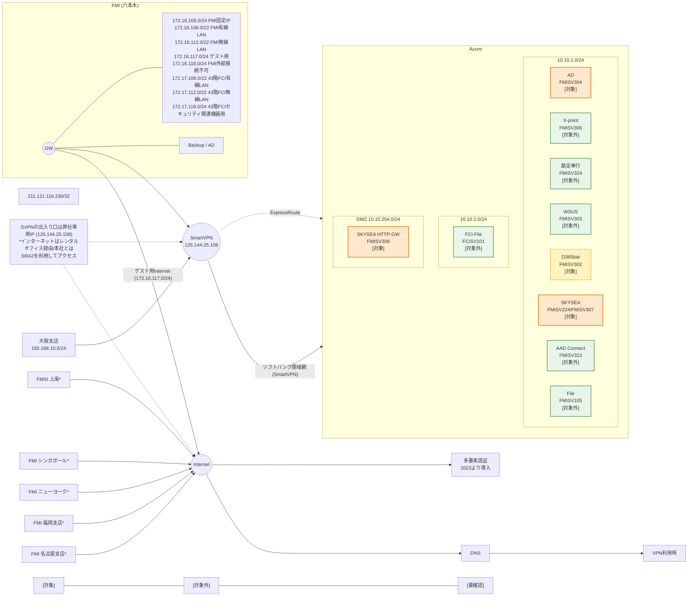

# FMI NW構成図 (Mermaid)

Source: `Azure-refactoring/20240201_FMI NW構成図.pdf` Page 2（2024年1月時点）

```mermaid
flowchart LR

  %% Left: Roppongi HQ
  subgraph HQ["FMI (六本木)"]
    HQGW((GW))
    HQNET["172.16.106.0/24 FMI固定IP<br/>172.16.108.0/22 FMI有線LAN<br/>172.16.112.0/22 FMI無線LAN<br/>172.16.117.0/24 ゲスト用<br/>172.16.118.0/24 FMI外部接続不可<br/>172.17.108.0/22 43階FCI有線LAN<br/>172.17.112.0/22 43階FCI無線LAN<br/>172.17.118.0/24 43階FCIセキュリティ関連機器用"]
    HQBA["Backup / AD"]
    HQGW --- HQNET
    HQGW --- HQBA
  end

  OSAKA["大阪支店<br/>192.168.10.0/24"]
  OSAKAIP["211.121.116.230/32"]
  NAGOYA["FMI 名古屋支店*"]
  FUKUOKA["FMI 福岡支店*"]
  NEWYORK["FMI ニューヨーク*"]
  SINGAPORE["FMI シンガポール*"]
  SHANGHAI["FMSI 上海*"]

  INTERNET((Internet))
  SMARTVPN(("SmartVPN<br/>126.144.25.108"))

  MFA["多要素認証<br/>2023より導入"]
  VPNUSER["VPN利用時"]
  DNS[DNS]

  %% Azure side
  subgraph AZ[Azure]
    subgraph VNET1["10.10.1.0/24"]
      AZ_AD["AD<br/>FMISV304<br/>[対象]"]
      AZ_XP["X-point<br/>FMISV306<br/>[対象外]"]
      AZ_KANJO["勘定奉行<br/>FMISV324<br/>[対象外]"]
      AZ_WSUS["WSUS<br/>FMISV303<br/>[対象外]"]
      AZ_D365["D365bat<br/>FMISV302<br/>[対象]"]
      AZ_SKY1["SKYSEA<br/>FMISV224/FMISV307<br/>[対象]"]
      AZ_AAD["AAD Connect<br/>FMISV323<br/>[対象外]"]
      AZ_FILE["File<br/>FMISV105<br/>[対象外]"]
    end

    subgraph VNET2["10.10.2.0/24"]
      AZ_FCI["FCI File<br/>FCISV101<br/>[対象外]"]
    end

    subgraph DMZ["DMZ 10.10.254.0/24"]
      AZ_SKY2["SKYSEA HTTP-GW<br/>FMISV309<br/>[対象]"]
    end
  end

  %% Main paths
  HQGW -->|"ゲスト用Internet (172.16.117.0/24)"| INTERNET
  INTERNET --> MFA
  INTERNET --> DNS
  DNS --> VPNUSER

  HQGW --> SMARTVPN
  OSAKA --> SMARTVPN
  NAGOYA --> INTERNET
  FUKUOKA --> INTERNET
  NEWYORK --> INTERNET
  SINGAPORE --> INTERNET
  SHANGHAI --> INTERNET

  SMARTVPN -->|"ソフトバンク閉域網 (SmartVPN)"| AZ
  SMARTVPN -.->|ExpressRoute| AZ

  %% Note
  NOTE["SVPNの出入り口は弊社専用IP (126.144.25.108)<br/>*インターネットはレンタルオフィス経由/本社とはSRA2を利用してアクセス"]
  NOTE -.-> SMARTVPN
  NOTE -.-> INTERNET

  %% Target legend
  LEGEND_T["[対象]"]
  LEGEND_N["[対象外]"]
  LEGEND_C["[要確認]"]
  LEGEND_T --- LEGEND_N --- LEGEND_C

  classDef target fill:#ffe8cc,stroke:#d97706,stroke-width:2px;
  classDef nontarget fill:#e8f5e9,stroke:#2e7d32,stroke-width:1.5px;
  classDef confirm fill:#fff3bf,stroke:#f59f00,stroke-width:2px,stroke-dasharray: 5 3;

  class AZ_AD,AZ_SKY1,AZ_SKY2 target;
  class AZ_XP,AZ_KANJO,AZ_WSUS,AZ_AAD,AZ_FILE,AZ_FCI nontarget;
  class AZ_D365 confirm;
```

