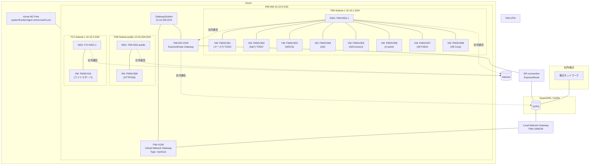

# Azure環境トラフィック経路（現状）

```mermaid
flowchart TB

subgraph OnPrem[社内/拠点]
  Sites[拠点ネットワーク]
end

subgraph SVPN[SmartVPN / SVPN]
  SVPNCloud[(SVPN)]
end

subgraph Azure[Azure]
  AAD["Azure AD Free<br/>systemfrontiermgmt.onmicrosoft.com"]

  subgraph VNet[FMI-NW 10.10.0.0/16]
    GatewaySubnet["GatewaySubnet<br/>10.10.255.0/24"]

    subgraph PublicSubnet[FMI-Subnet-public 10.10.254.0/24]
      NSGPublic[NSG: FMI-NSG-public]
      HTTPGW["VM: FMISV309<br/>(HTTPGW)"]
    end

    subgraph Subnet1[FMI-Subnet-1 10.10.1.0/24]
      NSG1[NSG: FMI-NSG-1]
      VM301["VM: FMISV301<br/>(メール?) TODO"]
      VM302["VM: FMISV302<br/>(bat?) TODO"]
      VM303["VM: FMISV303<br/>(WSUS)"]
      VM304["VM: FMISV304<br/>(AD)"]
      VM305["VM: FMISV305<br/>(ADConnect)"]
      VM306["VM: FMISV306<br/>(X-point)"]
      VM307["VM: FMISV307<br/>(SKYSEA)"]
      VM308["VM: FMISV308<br/>(VB Corp)"]
    end

    subgraph SubnetFCI[FCI-Subnet-1 10.10.2.0/24]
      NSGFCI[NSG: FCI-NSG-1]
      VM101["VM: FMISV101<br/>(ファイルサーバ)"]
    end

    VpnGW["FMI-VGW<br/>Virtual Network Gateway<br/>Type: VpnGw1"]
    ERGW["FMI-ER-VGW<br/>ExpressRoute Gateway"]
  end

  AAD --- VNet
end

LNWGW["Local Network Gateway<br/>FMI-LNWGW"]
VPNConn[FMI-VPN]
ERConn["ER-connection<br/>ExpressRoute"]

Internet[(Internet)]

%% Connections
Sites --- SVPNCloud
SVPNCloud --- LNWGW
LNWGW --- VpnGW
ERGW --- ERConn --- SVPNCloud

GatewaySubnet --- VpnGW
GatewaySubnet --- ERGW

NSGPublic --- HTTPGW
NSG1 --- VM301
NSG1 --- VM302
NSG1 --- VM303
NSG1 --- VM304
NSG1 --- VM305
NSG1 --- VM306
NSG1 --- VM307
NSG1 --- VM308
NSGFCI --- VM101

%% Traffic paths
NSG1 -. 社内通信 .-> ERGW
ERGW -. 社内通信 .-> SVPNCloud
NSGPublic -. 社外通信 .-> Internet
NSG1 -. 社外通信 .-> Internet
NSGFCI -. 社外通信 .-> Internet

```

補足
- 画像内の小さいラベルは一部読み取りが難しいため `TODO` を付与。
- 社外通信はNSGからパブリックIPへNAT後にInternetへ出る構成と読み取り。
- 社内通信はExpressRoute Gateway経由でSVPNへ到達。