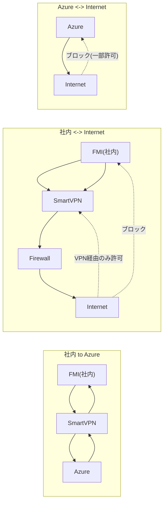

# 通信上のルール

```mermaid
flowchart LR

subgraph Rule1["社内 to Azure"]
  FMI1["FMI(社内)"] --> SVPN1["SmartVPN"] --> AZ1["Azure"]
  AZ1 --> SVPN1 --> FMI1
end

subgraph Rule2["社内 <-> Internet"]
  FMI2["FMI(社内)"] --> SVPN2["SmartVPN"] --> FW["Firewall"] --> NET1["Internet"]
  NET1 -. ブロック .-> FMI2
  FMI2 --> SVPN2
  NET1 -. VPN経由のみ許可 .-> SVPN2
end

subgraph Rule3["Azure <-> Internet"]
  AZ2["Azure"] --> NET2["Internet"]
  NET2 -. ブロック(一部許可) .-> AZ2
end

```

補足
- 社内 → Azure は SmartVPN 経由。
- 社内 → Internet も SmartVPN 経由。
- Internet → 社内はブロック。
- Azure → Internet は特に制限なし。
- Internet → Azure はブロック、例外的に一部許可。
- 現状、トラフィックログは収集していない。
