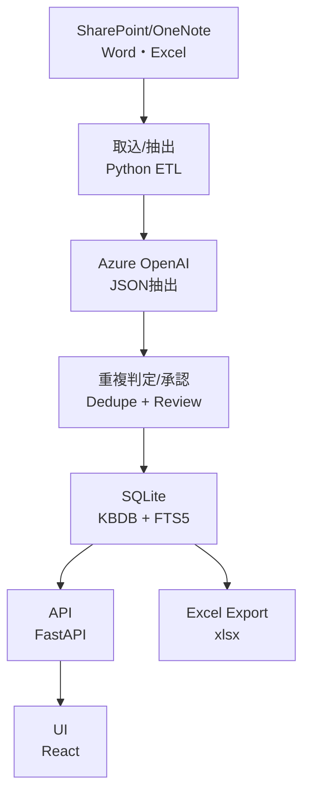
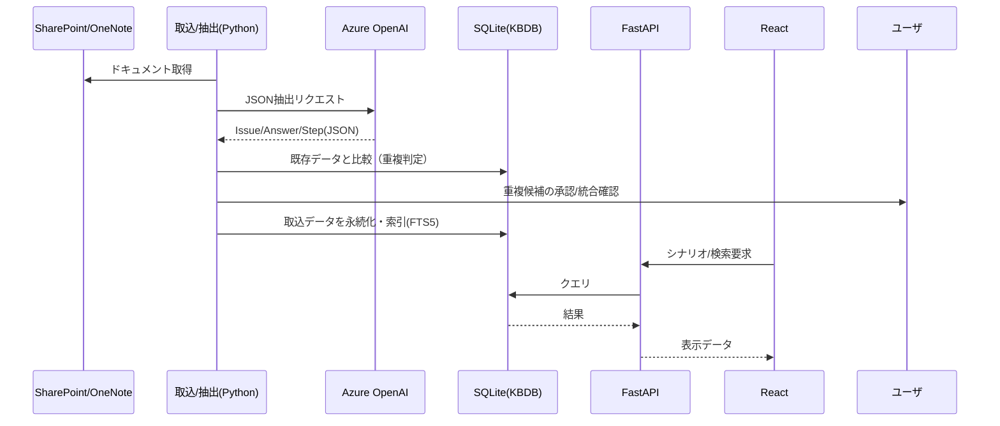

# FMI KBDB MVP 仕様

## スコープ
- 初期対象: IT とヘルプデスクのみ。
- 取込元: SharePoint の Word/Excel と OneNote。

## MVP 目標
- ドキュメントを取り込む。
- Issue / Answer / Step（手順）に分類する。
- 各項目を FMI 社内の運用シナリオに割り当てる。
- 複数シナリオへの割り当てを許可する。
- シナリオベースで Issue / Answer / Step を閲覧・検索できるようにする。

## データストア
- MVP の保管先: SQLite。

## レビュー / ロール
- MVP では正式な権限・ロールは定義しない。
- レビュアー識別は名前（ByName）のみ。

## エクスポート
- 作業用に Excel へエクスポート。

## 技術スタック（MVP）
- 言語/ランタイム: Python 3.11
- 取込: Microsoft Graph API（SharePoint/OneNote）
- 解析: python-docx（Word）、openpyxl（Excel）
- LLM: Azure OpenAI（JSON固定出力）
- データストア: SQLite（FTS5で全文検索）
- API: FastAPI（REST）
- UI: React（Vite）
- エクスポート: openpyxl または pandas で .xlsx 出力

## システム構成（関連コンポーネント概要）

## シーケンスフロー（MVP）

## MVP インフラ準備ステップ
1. Azure サブスクリプション/リソースグループを用意する。
2. Azure OpenAI リソースを作成し、デプロイ済みモデル名を確定する。
3. Entra ID でアプリ登録を作成し、Microsoft Graph の権限を付与する。
4. SharePoint/OneNote の対象サイト/ノートブックを確定し、アクセスを検証する。
5. Key Vault を用意し、Graph と Azure OpenAI のシークレットを保管する。
6. 実行環境（MVP想定: ローカル/VM/小規模App Service）を決定する。
7. 監視/ログ（MVP想定: Application Insights または簡易ログ）を用意する。
8. SQLite の配置先（ローカルディスク/共有フォルダ）とバックアップ方針を決める。

## MVP インフラ準備（具体チェックリスト）
### 1) Azure foundation
- オーナー: Cloud Admin（FMI）
- 作業:
  - サブスクリプション名: fmi-poc-ai
  - リソースグループ名: fmi-poc-ai
  - リージョン: East US 
  - 命名規約: fmi-proj-app
- 完了条件:
  - RG 作成済み
  - コスト管理タグ（owner/costcenter/env）付与済み

### 2) Azure OpenAI
- オーナー: Cloud Admin + AI Owner
- 作業:
  - リソース名: <AOAI_RESOURCE_NAME>
  - デプロイ済みモデル:
    - <MODEL_NAME_1>（deployment: <DEPLOYMENT_NAME_1>）
    - <MODEL_NAME_2>（deployment: <DEPLOYMENT_NAME_2>）※必要なら
  - クォータ/スループット確認（申請の有無）
- 完了条件:
  - デプロイ名が確定し、API から疎通済み

### 3) Entra ID アプリ登録（Graph）
- オーナー: IAM Admin
- 作業:
  - テナントID: <TENANT_ID>
  - アプリID: <CLIENT_ID>
  - 認証方式: <CLIENT_SECRET | CERTIFICATE>
  - 権限（最小）:
    - SharePoint: Sites.Read.All / Files.Read.All
    - OneNote: Notes.Read.All
  - 管理者同意（Admin consent）付与
- 完了条件:
  - Graph API で SharePoint/OneNote にアクセス成功

### 4) SharePoint / OneNote 対象確定
- オーナー: IT Ops Owner
- 作業:
  - SharePoint site URL: <SITE_URL>
  - Drive ID: <DRIVE_ID>
  - OneNote notebook ID(s): <NOTEBOOK_IDS>
  - アクセステスト（Graph）: 2026-01-30
- 完了条件:
  - サンプル文書の取得成功

### 5) Key Vault
- オーナー: Cloud Admin
- 作業:
  - Key Vault 名: <KV_NAME>
  - 収納シークレット:
    - AOAI_API_KEY
    - GRAPH_CLIENT_SECRET（または証明書）
  - アクセスポリシー: ETL/Backend のマネージドIDに read 付与
- 完了条件:
  - Key Vault からシークレット取得成功

### 6) 実行環境（MVP）
- オーナー: Tech Lead
- 方式: <LOCAL | VM | APP_SERVICE>
- 作業:
  - dev/test/prod: <DEV_ONLY | DEV_TEST | DEV_TEST_PROD>
  - ネットワーク: <PUBLIC | PRIVATE>
- 完了条件:
  - ETL と API が同一環境で実行可能

### 7) 監視/ログ
- オーナー: SRE/Tech Lead
- 方式: <APP_INSIGHTS | LOCAL_LOG>
- 作業:
  - 重要ログ: 取込件数/失敗件数/LLM 応答遅延/Graph エラー
  - 保持期間: <DAYS>
- 完了条件:
  - エラー時に追跡可能

### 8) SQLite 配置とバックアップ
- オーナー: Tech Lead
- 作業:
  - 配置先: <LOCAL_PATH | SHARED_PATH>
  - バックアップ: <DAILY | WEEKLY> / <RETENTION_DAYS>
  - 手動復元手順: <DOC_LINK_OR_FILE>
- 完了条件:
  - バックアップ/復元が手順化済み

## チケットシステム（将来）
- Jira を想定。
