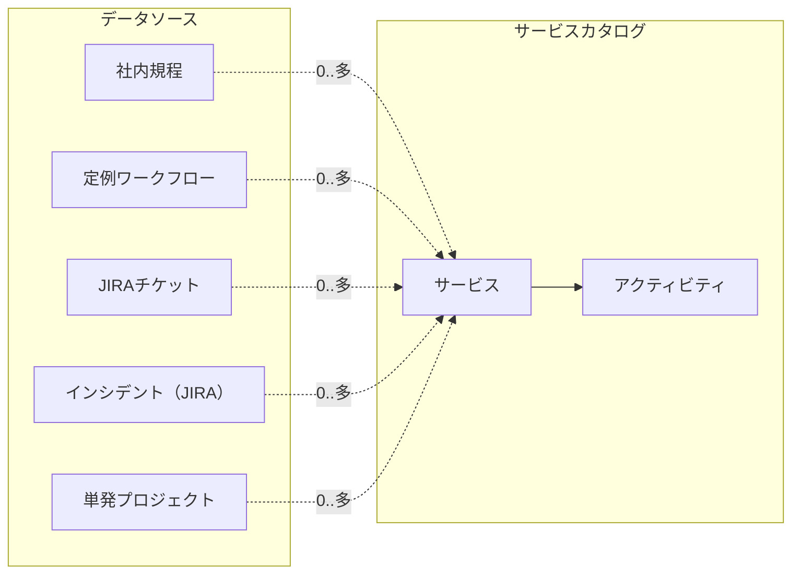
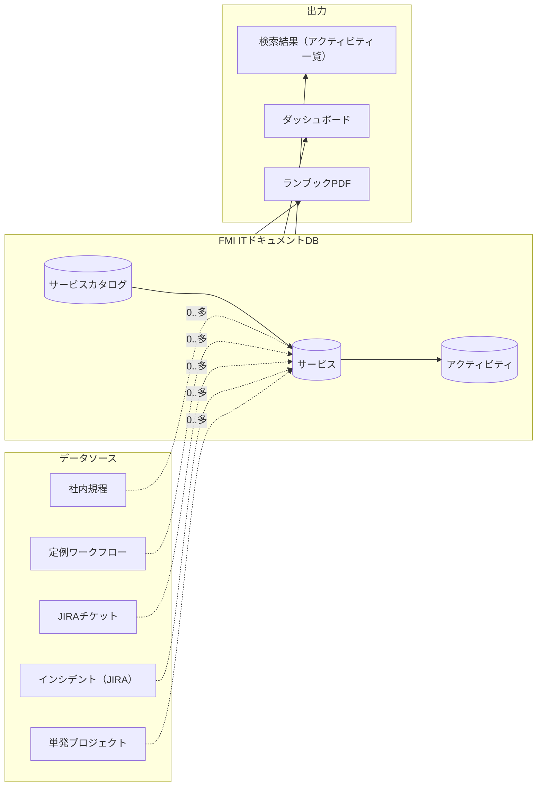
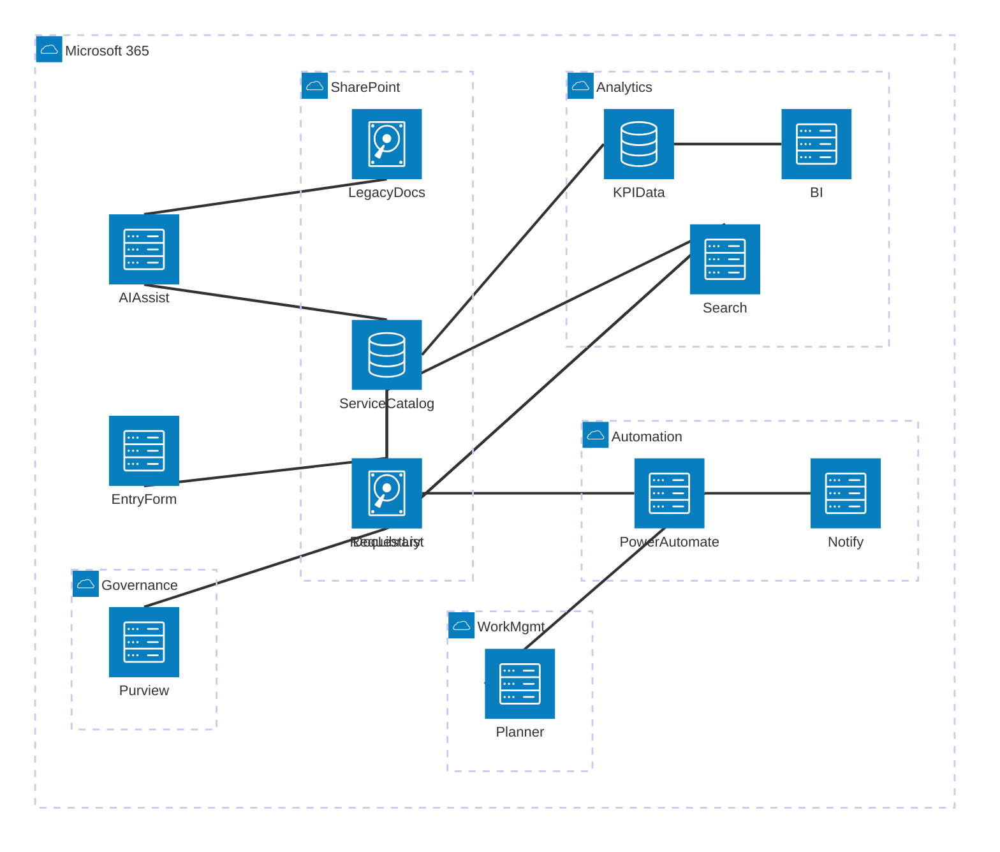
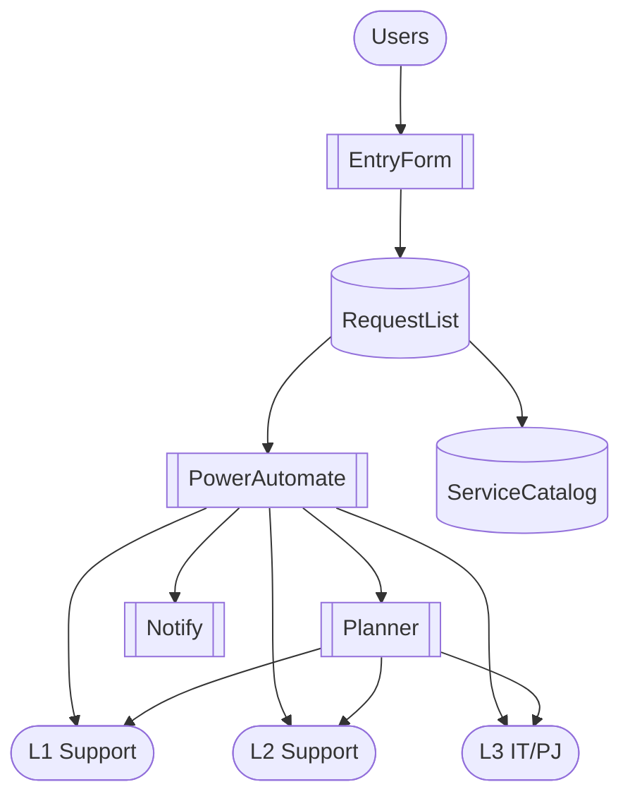

# FMI Bプラン｜IT業務カタログDB 構築アクションプラン

## 目的（Executive Summary）

本計画は、FMIにおける社内IT業務を「サービス（業務ID＝サービスID）」単位で可視化・標準化し、

- 規程と実務の接続
- 検索可能なカタログDB化
- L1/L2/L3の責任分界の明確化
- 将来的なAI分類・自動化の土台構築 を実現することを目的とする。

---

## 全体アーキテクチャ（Bプラン前提）

#### 図4：階層ビュー（サービスカタログ + データソース）

---
- 基盤：Microsoft 365（SharePoint Online / Power Automate / Planner）
- DB：SharePoint List（メタデータDB）
- 文書：SharePoint Document Library（規程・手順書・証跡）
- 受付：Microsoft Forms / SharePoint Form
- 作業管理：Planner（必要に応じて）

### 全体システム構成図（A案：2枚構成）

#### 図3：全体システム構成図（データソース → FMI ITドキュメントDB → 出力）

---
> **人員構成は図2を正とする**\
> **システム依存は図1を正とする**

#### 図1：System Architecture（システム構成）

---

#### 図2：Responsibility / RACI（人と運用の流れ）

---

## フェーズ別アクションプラン

※ 各フェーズで **必須 / 推奨 / 将来拡張** の技術スタックを明示する。

### 技術スタック一覧（記号）

- **SPO**：SharePoint Online
- **List**：SharePoint List
- **Lib**：SharePoint Document Library
- **PA**：Power Automate
- **Forms**：Microsoft Forms（またはSPOフォーム）
- **Planner**：Microsoft Planner
- **Teams**：Microsoft Teams
- **M365 Search**：Microsoft Search / SharePoint Search
- **Purview**：Microsoft Purview（保持・監査・eDiscovery）
- **Copilot/M365**：Microsoft 365 Copilot（利用可能範囲で）
- **Azure OpenAI**：Azure OpenAI（分類・抽出の精度を上げたい場合）

---

### Phase 0：前提設計（1〜2週間）

**成果物：設計方針・ID体系・責任分界の確定**

#### 技術スタック

- **必須**：SPO（設計メモ・合意形成）、Excel/SharePoint List（ID体系・RACI整理）
- **推奨**：Whiteboard/PowerPoint（構造図・合意）
- **任意**：Purview（保持要件がある場合）

#### 作業

- 業務単位の固定（業務ID＝サービスID）
- ID体系の確定（サービス/規程/システム/問題/プロジェクト）
- 責任分界（RACI＋L1/L2/L3）の明文化

---

### Phase 1：サービスカタログDB構築（2週間）

**成果物：最小サービスカタログ（20〜40件）**

**技術スタック**

- 必須：SPO + List（Service Catalog） + M365 Search
- 任意：PA（初期データ投入支援・通知）

#### SharePoint List（Service Catalog）列設計

- サービスID（主キー）
- サービス名
- サービス概要
- カテゴリ（複数）
- 対象システム（複数）
- 問題種別（複数）
- プロジェクトタグ（複数）
- 対象部署（複数）
- 主担当レベル（L1/L2/L3）
- エスカレーション条件
- 関連規程ID（複数）
- 証跡種別（ログ/稟議/一覧等）
- 標準SLA
- 受付URL

---

### Phase 2：規程・文書側の整備（並行実施 2週間）

**成果物：規程・手順書がDBと紐づく状態**

**技術スタック**

- 必須：SPO + Lib（規程/手順/証跡） + M365 Search

- 推奨：Purview（保持・監査ログ・ラベル運用が必要な場合）

- 任意：PA（改訂通知・期限通知）

- Document Library のメタデータ

  - 文書種別（方針/規程/手順/証跡）
  - 規程ID
  - 適用サービスID（複数）
  - 管理責任者
  - 改訂日 / 有効期限

- サービス⇄規程の双方向リンクを確立

---

### Phase 3：受付・Request・Taskの分離（2〜3週間）

**成果物：入口統一と作業の見える化**

**技術スタック**

- 必須：Forms（またはSPOフォーム） + List（Request） + PA（ワークフロー）

- 推奨：Planner（タスク実行の可視化）

- 任意：Teams（受付/通知の集約）

- Request List（申請/依頼）

  - サービスID
  - 依頼種別（通常/緊急/例外）
  - 依頼部署
  - 希望期限
  - 承認者

- Task管理

  - PA により標準タスク生成
  - Plannerと連携（任意）

- L1/L2/L3への自動割当ルール設計

---

### Phase 4：既存情報の集約とAI活用（3〜4週間）

**成果物：既存資産がカタログに吸収される**

**技術スタック**

- 必須：SPO（収集先） + Lib/List（格納） + M365 Search

- 任意（AI）：Copilot/M365（要件整理・要約） / Azure OpenAI（分類・抽出・ルール化）

- 任意（自動処理）：PA（取り込み・メタデータ付与・レビュー依頼）

- 既存資料（手順書・メール・Teams・監査証跡）を収集

- AIで以下を補助分類

  - 対応サービスID候補
  - 規程ID候補
  - 問題種別

※ 最終確定は人（責任者）

---

### Phase 5：運用プロセス化・自動化（継続）

**成果物：回り続ける仕組み**

**技術スタック**

- 必須：PA（通知・定期起票・棚卸リマインド） + List（KPI抽出元）

- 推奨：Planner（定期タスクの運用） + Teams（運用通知）

- 任意：Power BI（可視化を強めたい場合）

- 新規情報登録プロセスの標準化

- 定期作業（棚卸・レビュー）の自動リマインド

- KPI可視化（L1/L2/L3完結率、滞留時間）

---

## 責任分界モデル（要約）

| レベル | 主な責務     | DB上の役割         |
| --- | -------- | -------------- |
| L1  | 受付・定型対応  | Request起票、一次完結 |
| L2  | 物理・現地作業  | Task実行、資産更新    |
| L3  | 設計・例外・PJ | サービス定義、改善      |

---

## 成功条件（チェックポイント）

- サービスIDを起点に説明できる
- 規程と業務が相互に検索できる
- L3に流れる理由がDBで説明できる
- 人員不足/過多を感覚でなく数値で語れる

---

## 次アクション（直近2週間）

1. サービスID命名規則の確定
2. 最小サービス20件の洗い出し
3. Service Catalog Listの作成
4. L1/L2/L3責任割当の仮設定

---

※本ドキュメントはFMI社内ITの現実的運用を前提に作成されており、将来的なITSMツール移行にも耐える構造とする。

