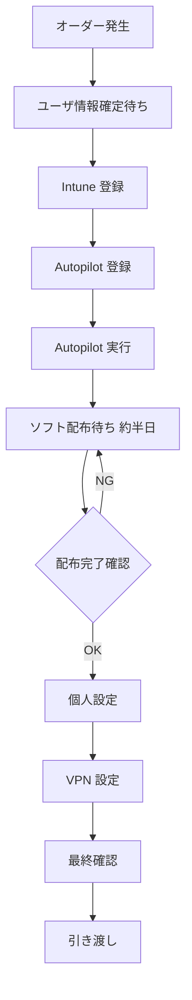
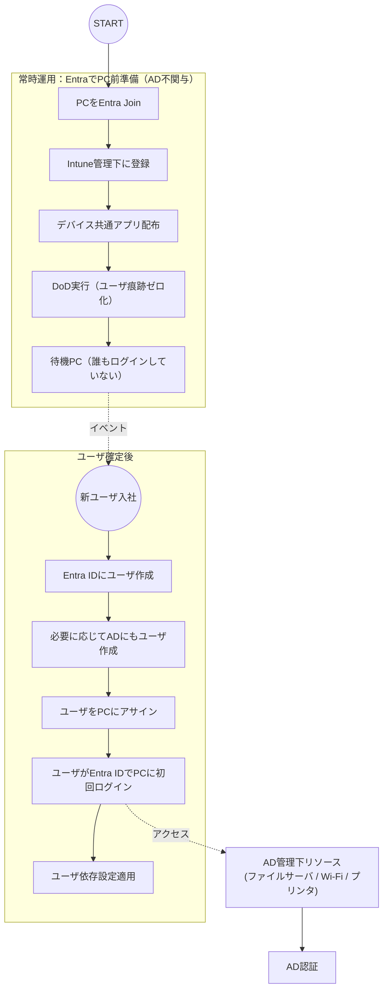

# キッティング手順 改修案 v2（Red Team反映版）

## 1. 目的と前提

### 目的

* **人の拘束時間（ハンズオン）を最小化**する
* **Autopilotの待ち時間を人の作業線から排除**する
* 外注 × オーダー不定期という制約下でも**破綻しない運用**にする

### 前提条件

* 外注作業が前提
* オーダーは不定期・少量
* 在庫作業は極小化したい

---

## 2. As-Is（現行フロー）

### As-Isの問題点

* Autopilot（非同期処理）が**人の作業主線**に乗っている
* ユーザ確定が起点となり、**前倒し可能な工程が全て後段化**
* 配布（デバイス工程）と利用開始（ユーザ工程）が混在

---

## 3. To-Be（改修案 v3：Entra中心／ADリソース分離案）

### 基本方針（更新）

* **PCセットアップとユーザ割当は Entra / Intune で完結**させる
* **ADはPC管理に関与させず**、AD管理リソース利用時のみ関与
* 作り置きPCは **Entra Join + DoD 完了状態**で待機

---

### To-Be フロー（Entra中心・AD分離）

---

### ポイント整理

* **PCは一貫してEntra管理**。AD Join は行わない
* ユーザは Entra ID を主IDとしてログイン
* AD は「リソース利用時の認証先」としてのみ関与
* 新ユーザ作成は **Entra →（必要なら）AD** の順

---

### 4.1 補充が回らずAs-Isに戻るリスク（最重要）

**対策：補充を納品完了条件に昇格**

* 納品完了（Definition of Done）を以下とする

  1. ユーザPC引き渡し完了
  2. **待機PCが2台に復帰していること**

* 上記を満たさない場合、検収不可（またはSLA未達）

* 待機PC在庫は**常時オープンの定常チケット**で管理

---

### 4.2 前準備完了の曖昧化リスク

**対策：前準備完了を「判定可能な3点」に固定**

前準備完了 = 以下すべてOK

1. Autopilot登録済み（Assigned）
2. Intune管理下（MDM = Intune）
3. 必須デバイスアプリが **Installed** 状態

※ Outlook利用可、VPN接続可などは**含めない**

---

### 4.3 ユーザ依存設定の混入リスク

**対策：禁則ルールを明文化**

* 待機PCには以下を**入れない**

  * ユーザ割当アプリ
  * ユーザ依存ポリシー
  * ユーザ必須ESP条件

* 待機用デバイスグループを固定し、割当を分離

---

### 4.4 外注手順逸脱・保管不備リスク

**対策：最低限のガバナンスを固定**

* 保管場所は1か所固定
* 待機PCには管理番号ラベルを貼付
* 台帳（SharePoint等）で以下4項目のみ管理

  * 管理番号 / 状態 / 最終作業者 / 最終更新日

---

## 5. KPI（客観指標のみ）

* 待機PC **2台維持率**（日次）
* オーダー後の **ハンズオン時間（分/台）**
* 隠れ待ち発生回数（Installed待ち等）

※ 主観評価はKPIに含めない

---

## 6. まとめ（意思決定ポイント）

* 本改修案の価値は**技術ではなく運用強制力**にある
* 補充を検収条件に組み込むことで、To-Beは時間経過でも崩れない
* 在庫は2台限定のため、外注・不定期オーダーでも心理的負担が小さい

この条件を受け入れられるなら、本案は実行可能かつ効果が出る。
