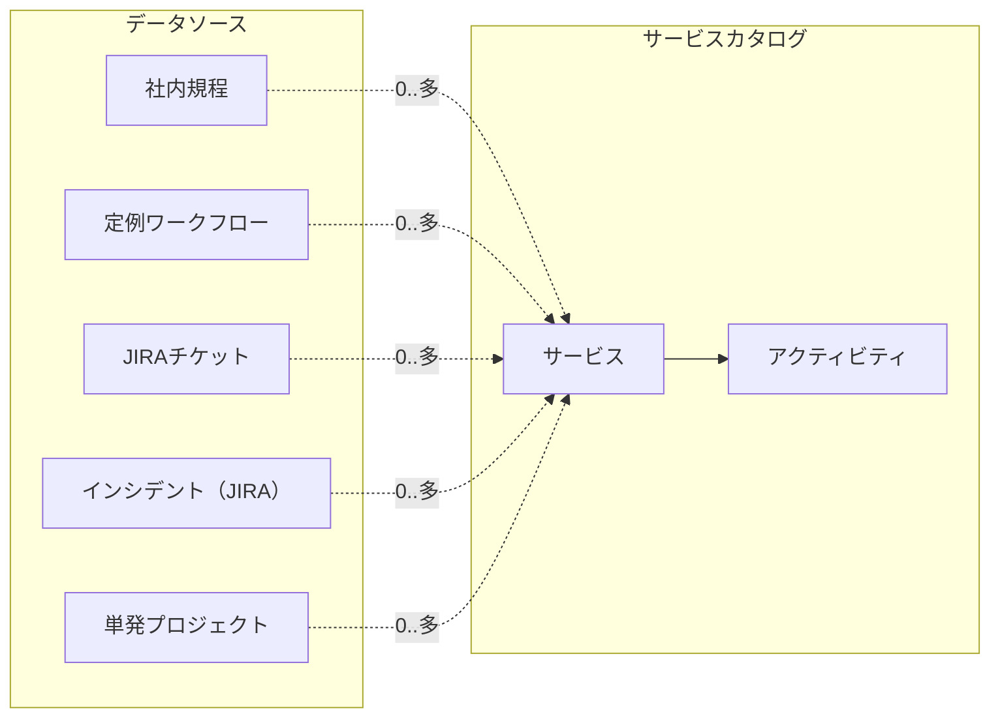

# Task List 1: Structure and Data Element Definition

| ID | Task | Owner |
| --- | --- | --- |
| 1 | 業務単位の固定（業務ID＝サービスIDの原則を確定） | |
| 2 | サービスID命名規則の確定 | |
| 3 | ID体系の確定（サービス／規程／システム／問題／プロジェクト） | |
| 4 | 責任分界（RACI＋L1/L2/L3）定義 | |
| 5 | Service Catalog Listの列設計（サービスID／サービス名／概要／カテゴリ／対象システム／問題種別／プロジェクトタグ／対象部署／主担当レベル／エスカレーション条件／関連規程ID／証跡種別／標準SLA／受付URL） | |
| 6 | Request Listの列設計（サービスID／依頼種別／依頼部署／希望期限／承認者） | |
| 7 | Document Libraryメタデータ定義（文書種別／規程ID／適用サービスID／管理責任者／改訂日／有効期限） | |
| 8 | サービス⇄規程の双方向リンク設計 | |
| 9 | L1/L2/L3への自動割当ルール定義 | |
| 10 | 最小サービス20件の洗い出し | |

## Data Structure Diagram (Master Scheme)

