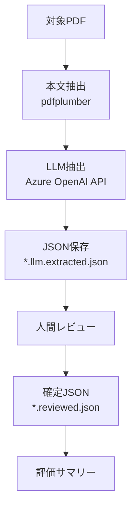

# LLM抽出フロー設計（叩き台）

## 目的
- ポリシー文書からサービスニーズ抽出に必要な情報をLLMで抽出する
- 人間レビュー前提で、抽出→確認→確定の流れを標準化する

## 前提
- Azure OpenAI API（消費課金）を使用
- 出力は `schema.md` に準拠（`reviewer_notes` 含む）
- 人間レビュー必須

## 対象データ
- 入力: PDF（ポリシー/規程）
- 出力: `*.llm.extracted.json` と `*.reviewed.json`

## フロー（案）
1. **入力準備**
   - 対象PDFを `run-book/POC/Testdata` に配置
   - 文書IDはファイル名先頭（例: `07-0120`）

2. **本文抽出（テキスト化）**
   - `pdfplumber` で全文を抽出
   - 文字化け/空白の確認（簡易チェック）

3. **LLM抽出（Azure OpenAI）**
   - 入力: `doc_id`, `title`（可能なら自動抽出）, 本文
   - 出力: JSON（`schema.md` 準拠）
   - 追加制約:
     - 不明は空配列/空文字にする
     - 推測で補完しない

4. **保存**
   - `*.llm.extracted.json` を保存
   - `reviewer_notes` は空で初期化

5. **人間レビュー**
   - `llm-extraction-review-template.md` を使用
   - 修正点を `*.reviewed.json` に反映
   - `reviewer_notes` に判断理由を記入

6. **評価**
   - 主要フィールドの網羅性/誤り率
   - レビュー工数（時間/修正量）

## システムフロー図（Mermaid）

## 入出力仕様（最小）
- 入力: PDFパス
- 出力: JSON（以下のフィールド必須）
  - `doc_id`, `title`, `doc_type`, `effective_dates`, `revision_history`,
    `scope_assets`, `roles`, `responsibilities`, `prohibitions`,
    `reporting_triggers`, `required_actions`, `reviewer_notes`, `evidence_links`

## エラーハンドリング
- 抽出テキストが極端に短い場合は失敗とみなす
- JSONパース不能は再実行

## 判定ポイント（PoC）
- LLM抽出の結果がレビューで「OK」になる割合
- 方針型文書での有効性

## TODO（確定が必要な項目）
- Azure OpenAIのデプロイ名・モデル
- トークン上限・分割方針
- 具体的なプロンプト
- レビュー工数の許容値
