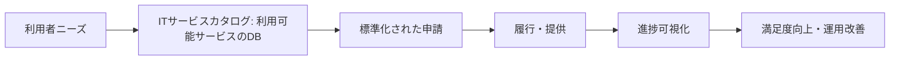
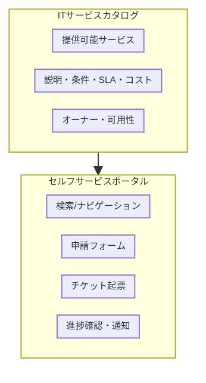
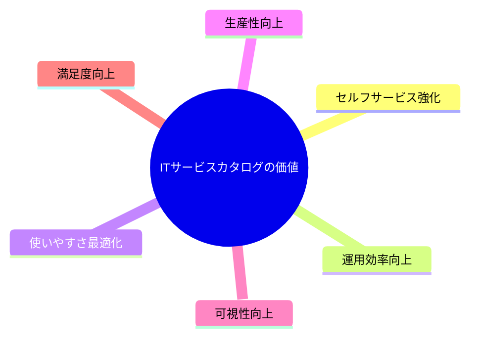
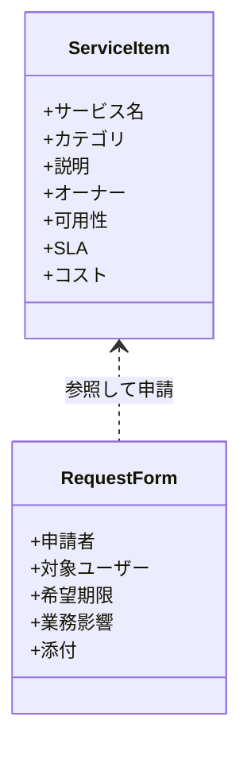
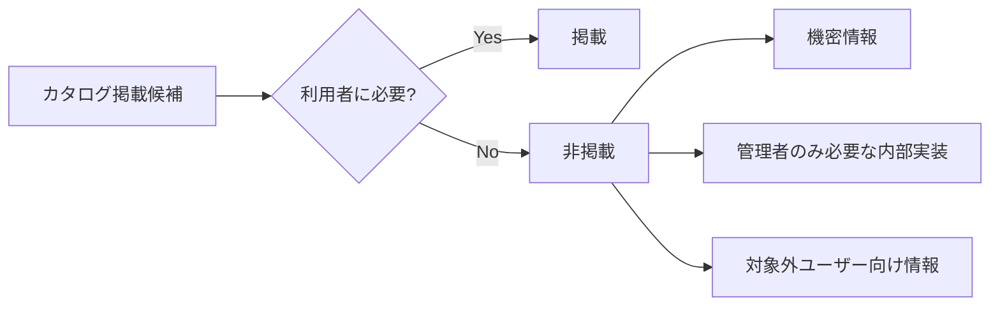
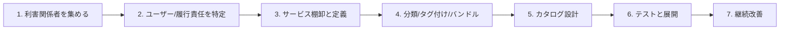
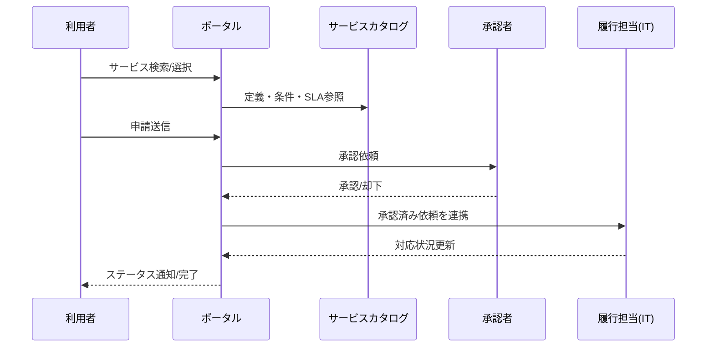
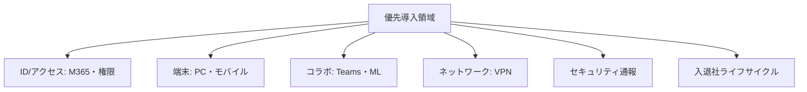
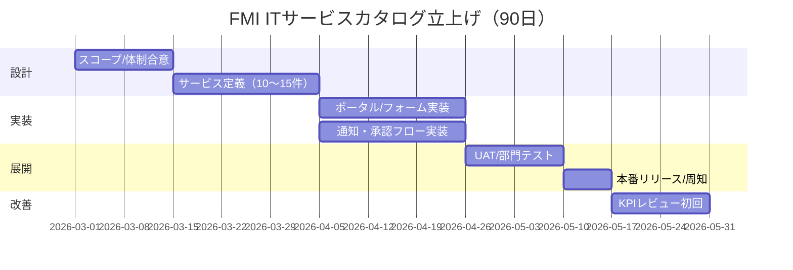
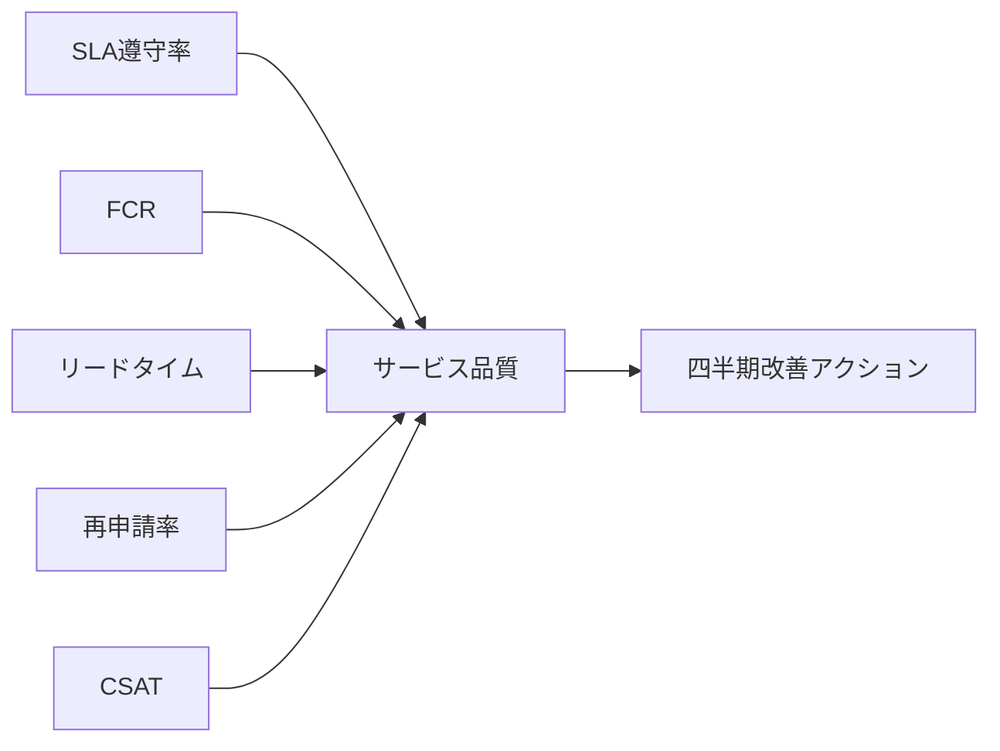

# ServiceNow定義をベースにしたFMI向けITサービスカタログ紹介資料（PPT構成ドラフト）

> 出典: `run-book/it-service-catalogue/IT サービスカタログとは？ - ServiceNow.pdf`  
> 目的: ServiceNowの定義をFMI ITに適用するための共通理解をつくる

---

## Slide 1. タイトル

**ServiceNowのサービスカタログ定義をFMI ITへ適用する**  
FMI ITサービスカタログ導入の考え方と実装イメージ

- 対象: IT部門、部門IT担当、業務オーナー
- ゴール: 「何を載せるか」「どう運用するか」「どう改善するか」を合意する

---

## Slide 2. なぜ今サービスカタログか

- 依頼窓口が分散し、対応品質・速度がばらつく
- 依頼内容の定義が曖昧で、手戻りが多い
- 対応状況が見えず、利用者体験が低下しやすい

**ServiceNow定義の要点**
- サービスカタログは「社内で利用できるITリソースのデータベース」
- 利用者ニーズに効率的・効果的に応える設計が必要

---

## Slide 3. サービスカタログの定義（ServiceNow）

- カタログは「メニュー」であり、申請の入口を標準化する
- サービス、条件、SLA、コストなどを明示する

---

## Slide 4. サービスカタログとセルフサービスポータルの違い

- カタログ: 「何が頼めるか」の定義
- ポータル: 「どう頼むか」のUI
- 実運用では両者を統合して提供する

---

## Slide 5. ServiceNowが示す主なメリット

- 利用者: 必要サービスを自力で特定しやすい
- IT部門: 定型処理を標準化・自動化しやすい
- 管理者: 指標に基づく改善判断がしやすい

---

## Slide 6. カタログに含めるべき情報（ServiceNow準拠）

- 最低限、上記7項目は全サービスで統一管理する
- 申請フォームは必要最小限で設計する

---

## Slide 7. 含めるべきでない情報

- 機密情報や不要な詳細は除外する
- 対象ユーザーに応じてサービスを絞る
- 「選択疲れ」を防ぐ

---

## Slide 8. ServiceNow流の構築ステップ

- まず目的と利用者を定義する
- 展開後もKPIで継続的に改善する

---

## Slide 9. FMI適用時の業務フロー（To-Be）

- 申請から完了通知までを一気通貫で見える化
- 承認・履行責任を明確化

---

## Slide 10. FMIで最初に定義すべきサービス領域

- 申請件数が多く標準化効果が大きい領域から開始
- まず10〜15サービスに絞って品質を安定化

---

## Slide 11. 導入ロードマップ（90日）

- 3か月で最小実用版（MVP）を公開
- 以降は四半期ごとに追加拡張

---

## Slide 12. 成功指標（KPI）

- SLA遵守率
- 初回解決率（FCR）
- 申請リードタイム
- 再申請率（フォーム不備）
- CSAT（利用者満足度）

---

## Slide 13. 付録: FMI版サービス項目（初期案）

- PC初期セットアップ
- M365アカウント発行/変更
- 共有フォルダ権限付与
- ソフトウェア導入申請
- VPN設定
- Teams会議トラブル対応
- セキュリティインシデント報告
- 入社/異動/退職の一括IT手配

詳細は `run-book/it-service-catalogue/service-catalogue-onapage.md` を参照。

---

## Slide 14. 参考情報

- `run-book/it-service-catalogue/IT サービスカタログとは？ - ServiceNow.pdf`
- `run-book/it-service-catalogue/service-catalogue-onapage.md`

