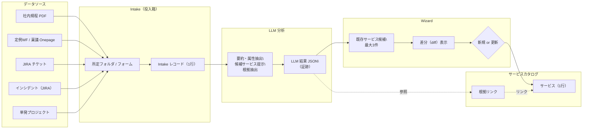

# 業務カタログ自動更新構想 --OnePager--

## 目的
- 業務カタログを **最低限のマニュアルワーク** で維持する
- 設計の美しさより **運用が回り続けること** を最優先する
- **人間は決断と責任**、機械（LLM）は分析と整理を担う

---

## 基本思想
> 人間は決める  
> LLM は材料を揃える

- LLM は **判断・更新を行わない**
- Wizard は **差分と影響を可視化する**
- 業務カタログは **1サービス＝1行（Single Source of Truth）** を維持する
- 多テーブル正規化は初期段階では行わない

---

## 全体フロー（Mermaid）

