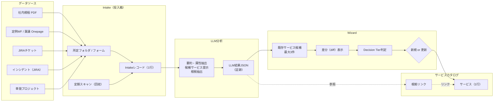

# Run-book Wizard Plan: 業務カタログ自動更新 + FMI社内IT業務の分け方
最終更新日: 2026-02-05

## 目的
- 業務カタログを **最低限のマニュアルワーク** で維持する
- 設計の美しさより **運用が回り続けること** を最優先する
- **人間は決断と責任**、機械（LLM）は分析と整理を担う
- FMIの社内IT業務を「サービス / リクエスト / タスク（アクティビティ） / 業務フロー / 規程 / KB」に分ける理由と効果を関係者に短時間で理解してもらう

---

## 基本思想
> 人間は決める  
> LLMは材料を揃える

- LLMは **判断・更新を行わない（判断の材料とTierを提示）**
- Wizardは **差分と影響を可視化する**
- 業務カタログは **1サービス＝1行（Single Source of Truth）** を維持する
- 多テーブル正規化は初期段階では行わない

---

## Red Team対応方針（壊れにくさの補強）

### 1) 判断を3段階に落とす（Decision Tier）
全件承認をやめ、**人が本当に決断すべきものだけ前に出す**。

| Tier | 意味 | 人の関与 |
| --- | --- | --- |
| Tier 0 | 既存サービスに影響なし（証跡追加のみ） | 自動反映OK |
| Tier 1 | 既存サービスの説明/リンク更新 | 後追い承認（まとめて） |
| Tier 2 | サービス定義変更 / 新規 | 事前承認必須 |

### 2) SSOTは1行、履歴は別物（Decision Log）
理由・時系列・承認者を**1行SSOT内に必須記録**する。

```yaml
decision_log:
  - date: 2026-02-01
    type: update
    reason: 規程第12条改訂に伴う反映
    evidence: 規程PDF p.4
    approved_by: Chen
```

### 3) KBとタスクの混在を防ぐ（役割で線を引く）
- KB: 判断・例外・注意点・背景を書く（Why）
- タスク（Activity）: 実行可能な最小手順のみ（How）
- **KB → タスク参照はOK / タスク → KB参照はNG**

### 4) Intakeは入口ではなく回収装置
入口統一は諦め、**後から必ず回収する**運用にする。
- Slack / 口頭 / 直依頼 → チケット or Onepage を後付け
- Wizardは **定期スキャン** で未反映を回収

---

## 全体フロー（Mermaid）



---

## 1. 今日伝えたい結論

- 今回の分け方は **仕事を増やすためではなく、仕事を減らすため** の整理
- ITILの考え方と **整合したうえで、FMIの実務に落とした翻訳**
- 目的はシステム導入ではなく、**責任・変更・改善を回せる構造を作ること**

---

## 2. 現状の課題（全員が感じていること）

- 依頼の入口がバラバラで、毎回ヒアリングが発生する
- 例外・判断がL3に集中し、プロジェクトが中断される
- 手順・規程・ナレッジの違いが分からず、探す時間が増える
- 監査・説明のたびに「どこに何が書いてあるか」を掘り起こす

👉 **個々が頑張って回しているが、構造的に詰まりやすい**

---

## 3. なぜ「分けないと」いけないのか

### 混ぜて管理すると起きること

- 変更頻度が違うものが混ざり、更新されなくなる
- 検索しても欲しい情報に辿り着かない
- 「誰が直すのか」「どこに書くのか」で毎回迷う

👉 **分ける = 更新頻度と責任を揃える = 運用が回る**

---

## 4. 分け方の全体像（6つの役割）

| 区分 | 役割 | 変更頻度 | 主な責任 |
|---|---|---|---|
| サービス | ITが提供する価値の単位 | 低 | 定義・責任分界 |
| リクエスト | 個別の依頼・案件 | 高 | 実績・KPI |
| タスク（アクティビティ） | 実行ステップ | 高 | 定型化・自動化 |
| 業務フロー | 作業の流れ・分岐 | 中 | 手順の骨格 |
| 規程 | 守るべきルール | 低 | 統制・監査 |
| KB | 現場の知恵 | 高 | 効率化・属人性排除 |

---

## 5. サービスとは何か

- 利用者が「これをやってほしい」と呼べる **価値の単位**
- 例：
  - 新入社員オンボーディング
  - 権限変更
  - 端末交換
- **変わりにくい名前**なので、カタログの主キーにする

---

## 6. リクエストとは何か

- サービスが必要になった **個別ケース**
- 例：
  - 4/1入社のAさん
  - Bさんの異動対応
- 日々増え続け、
  - 業務量
  - SLA
  - L1/L2/L3完結率
 などの根拠になる

---

## 7. タスク（アクティビティ）とは何か

- リクエストを完了させる **具体的な実行単位**
- 例：
  - Entra ID作成
  - Intune割当
  - 資産台帳更新

### 表記について
- ITIL公式用語：**アクティビティ（Activity）**
- 実務・ツール用語：タスク
- FMIでは **「タスク（アクティビティ）」に表記統一**

---

## 8. 業務フローとは何か

- タスク（アクティビティ）の **順番・分岐・承認** を含む流れ
- サービスごとの「手順の骨格」
- タスクより安定し、規程より柔軟

---

## 9. 規程とは何か

- なぜそれをやるのか、何を守るのかという **ルールの根拠**
- 例：
  - アクセス管理
  - ID棚卸
  - ログ保管
- **サービスに紐づけることで監査説明が容易になる**

---

## 10. KBとは何か

- 現場のコツ・FAQ・トラブル対応例
- 正確さより **更新しやすさを優先**
- L1/L2の完結率を上げる武器

---

## 11. 1つの例で見る全体像（オンボーディング）

- サービス：新入社員オンボーディング
- リクエスト：Aさん入社対応
- タスク（アクティビティ）：
  - アカウント作成
  - PCキッティング
- 業務フロー：入社通知 → 承認 → 作業 → 証跡 → 完了
- 規程：ID管理・アクセス権限
- KB：よくある詰まりと対処法

👉 **規程は変えず、タスクとKBを改善できる**

---

## 12. チームにとってのメリット

- L1/L2：定型が早く閉じ、往復が減る
- L3：例外・設計・PJに集中できる
- 全体：
  - 引き継ぎが楽になる
  - 「人が足りないか」を数字で議論できる

---

## 13. まずやること（小さく始める）

- サービスを20件に絞って定義
- 入口（リクエスト）を統一
- タスク（アクティビティ）はテンプレから
- 完璧を目指さず、回しながら改善

---

## 14. 最後に

- この分け方は **ルール強化ではなく、迷子削減**
- 仕組みが整うほど、個人の負担は減る
- まずは協力して「分ける」ことから始めたい
