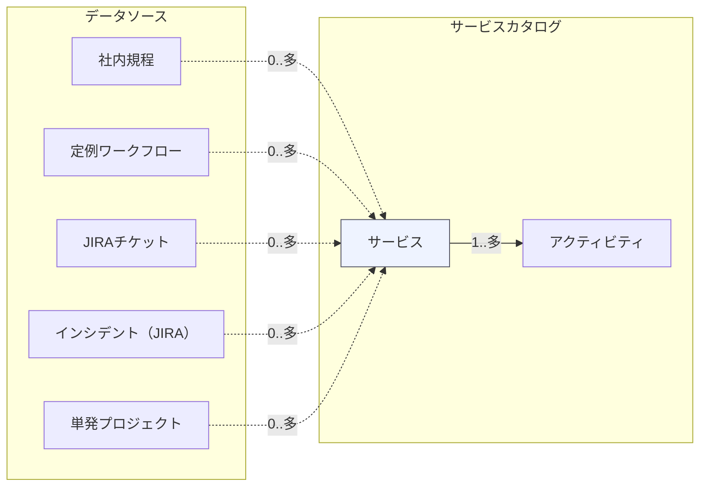

# Service Catalog DB: Data Sources (Draft)

This file captures how each Service can link to data sources. The relationship is **0..many** from Service to each data source type (a Service may have none).

## Flowchart (Service Catalog → Service → Activities + Data Sources)

